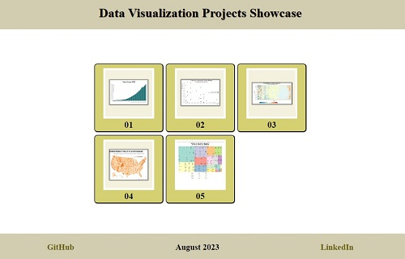

🔔 🔔 🔔
---

## Data Visualization Course

Welcome to the **Data Visualization Course** repository! The course is designed to teach the fundamentals of data visualization using various tools and libraries. Each project is carefully crafted to provide practical experience in creating effective visualizations from different datasets.
This repository contains my solutions to the projects from the Data Visualization course. Throughout the course, I've created visualizations to enhance my data visualization skills.

## Technologies used

- HTML
- CSS
- JavaScript
- D3.js

## Course Showcase

Explore all of the Data Visualization course projects in action on the [Showcase Site](https://elenacoder.github.io/data-vizualization-d3.js/).

## Project demos

The following projects are included in this repository:

- [Project 1](./bar-chart/README.md): [Visualize Data with a Bar Chart ](https://elenacoder.github.io/data-vizualization-d3.js/bar-chart/)
- [Project 2](./scatterplot-graph/README.md): [Visualize Data with a Scatterplot Graph](https://elenacoder.github.io/data-vizualization-d3.js/scatterplot-graph/)
- [Project 3](./heap-map/README.md): [Visualize Data with a Heat Map](https://elenacoder.github.io/data-vizualization-d3.js/heap-map/)
- [Project 4](./choropleth-map/README.md): [Visualize Data with a Choropleth Map](https://elenacoder.github.io/data-vizualization-d3.js/choropleth-map/)
- [Project 5](./treemap-diagram/README.md): [Visualize Data with a Treemap Diagram](https://elenacoder.github.io/data-vizualization-d3.js/treemap-diagram/)

## Acknowledgments

I would like to express my gratitude to the [Data Visualization course](https://www.freecodecamp.org/learn/data-visualization/) creators for sharing their expertise and facilitating a rewarding learning journey.

## License

This project is licensed under the MIT License.

---